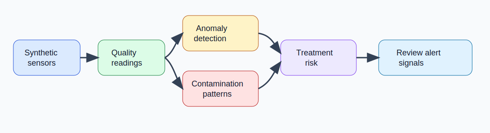
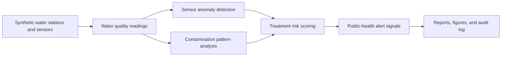

# AI-Powered Water Quality Monitoring Platform

<p align="center"><strong>Research-grade water quality monitoring platform for detecting contamination patterns, sensor anomalies, treatment risk, public-health alert signals, and environmental safety trends using synthetic sensor data.</strong></p>

<p align="center">
  <a href="../../actions/workflows/python-checks.yml"></a>
  <a href="LICENSE"></a>
  
  
</p>

> **Public-health boundary:** this repository uses fictional synthetic stations, sensors, treatment plants, readings, and alert signals by default. It is research and decision-support infrastructure only. It must not be used as an official drinking-water safety certification tool, emergency warning system, treatment directive, or public-health order without validated field data, certified laboratory confirmation, regulatory review, and human expert oversight.

---

## Research objective

Can an AI-powered water quality monitoring platform detect contamination patterns, sensor anomalies, treatment risk, and public-health alert signals early enough to support transparent environmental safety review?

| Research question | Evidence generated locally |
| --- | --- |
| Which sensor readings look abnormal? | Sensor anomaly table and anomaly figures |
| Which stations show contamination patterns? | Contamination event register and pattern scores |
| Which treatment plants need review? | Station and plant treatment-risk summary |
| Which regions show public-health alert signals? | Alert-priority table and regional summaries |
| Can review decisions remain auditable? | Hash-chained audit ledger |
| Can the pipeline run without sensitive public-health data? | Synthetic fictional sensor corpus |

---

## Architecture

<p align="center"></p>



---

## Run today — no real public-health data needed

```bash
python scripts/run_synthetic_water_lab.py
```

Windows quick start:

```bat
cd %USERPROFILE%\ai-powered-water-quality-monitoring-platform
git pull

py -m venv .venv
.venv\Scripts\activate

python -m pip install --upgrade pip
python -m pip install -r requirements.txt
python scripts/run_synthetic_water_lab.py
```

Optional controls:

```bash
python scripts/run_synthetic_water_lab.py --stations 18 --hours 168 --seed 42
```

---

## Generated local outputs

```text
outputs/results/synthetic_stations.csv
outputs/results/synthetic_treatment_plants.csv
outputs/results/synthetic_sensor_readings.csv
outputs/results/synthetic_sensor_anomalies.csv
outputs/results/synthetic_contamination_events.csv
outputs/results/synthetic_treatment_risk.csv
outputs/results/synthetic_alert_signals.csv
outputs/results/synthetic_station_risk_summary.csv
outputs/results/synthetic_water_quality_summary.json
outputs/reports/synthetic_water_quality_report.md
outputs/audit/water_quality_audit_log.jsonl

outputs/figures/synthetic_anomaly_counts.png
outputs/figures/synthetic_contamination_risk.png
outputs/figures/synthetic_treatment_risk.png
outputs/figures/synthetic_alert_priority.png
outputs/figures/synthetic_parameter_trends.png
```

---

## Sensor indicators included

| Indicator | Review purpose |
| --- | --- |
| pH | Acidity/alkalinity excursion review |
| Turbidity | Suspended solids and contamination pattern signal |
| Chlorine residual | Treatment residual drop signal |
| Dissolved oxygen | Environmental water stress indicator |
| Conductivity | Dissolved solids and intrusion proxy |
| Nitrate | Agricultural/runoff contamination proxy |
| Temperature | Seasonal and operational context |
| E. coli proxy indicator | Synthetic microbial risk signal for research only |

---

## What the system audits

| Audit area | Examples |
| --- | --- |
| Sensor anomalies | Missing readings, robust z-score outliers, sensor drift, physical-range violations |
| Contamination patterns | Turbidity surge, chlorine drop, nitrate spike, microbial proxy increase |
| Treatment risk | Plant-level and station-level risk from recent readings and anomaly burden |
| Public-health alert signals | Synthetic watch/elevated/critical review flags, not official alerts |
| Transparency | Rule rationale, risk drivers, and hash-chained audit records |

---

## Human governance boundary

This lab supports research, simulation, and environmental safety review. Real-world deployment requires certified sensors, calibration checks, validated thresholds, laboratory confirmation, water-utility procedures, regulatory review, emergency communication governance, privacy review, and human expert oversight.

The system should never be used as the sole basis for boil-water advisories, drinking-water safety certification, treatment changes, public-health orders, or panic-inducing public warnings.

---

## Repository map

```text
src/waterqual/
  synthetic.py       # fictional stations, treatment plants, and sensor readings
  anomalies.py       # sensor anomaly and data-quality checks
  contamination.py   # contamination pattern detection
  risk.py            # treatment and station risk scoring
  alerts.py          # synthetic public-health alert signal generation
  audit.py           # hash-chained audit ledger
  visualization.py   # local figures
  reporting.py       # Markdown report
scripts/
  run_synthetic_water_lab.py
docs/
  methodology.md
  public_health_boundary.md
  synthetic_lab.md
  report_template.md
tests/
  test_synthetic.py
  test_detection.py
  test_pipeline.py
  test_audit.py
```

---

## Limitations

- Synthetic data validates the pipeline but does not prove real-world safety performance.
- Thresholds are transparent research heuristics, not regulatory limits or certified operating rules.
- Alert signals are review prompts, not official public-health warnings.
- Real deployments require calibration, laboratory validation, governance, and expert review.
